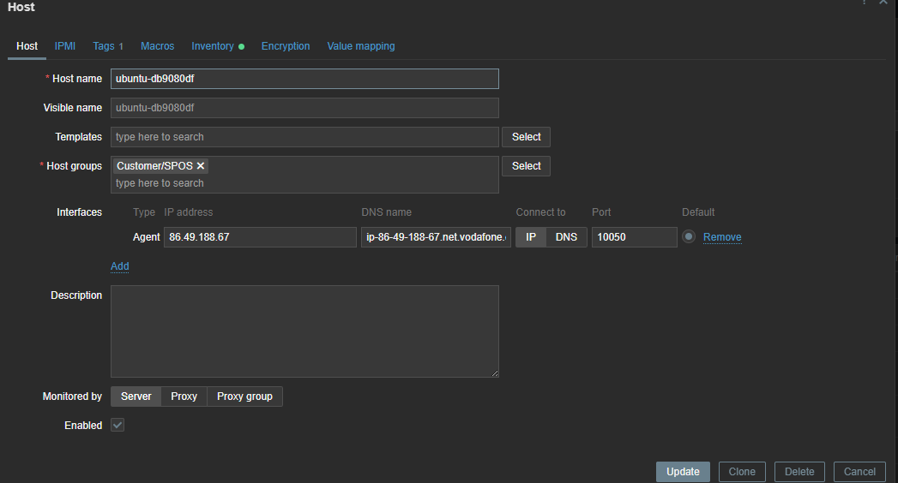

V souboru Vagrantfile je potřeba přidat, aby si virtuálka po spuštění automaticky vzala skripty ze stejné složky, kde se nachází Vagrantfile, a po instalaci je spustila.

V souboru installagent je instalace Zabbix agenta podle návodu, který je uvedený na webu Vagrantu.

V souboru configureagent jsou na prvních třech řádcích příkazy, které zajistí, že každý stroj bude mít unikátní hostname.
Dále následuje konfigurace agenta, kde bylo důležité:

na řádku 6 doplnit, aby si to vzalo vygenerovaný hostname,

a na řádku 10 přidat do HostMetadata slovo SPOS, které je nastavené v pravidlech na serveru Enceladus.